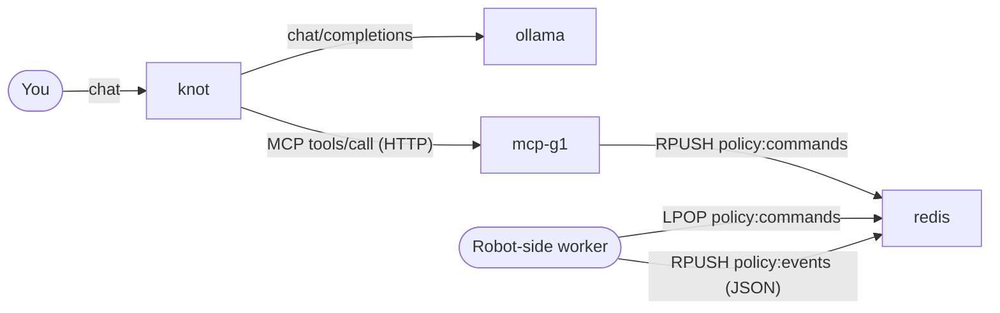

# ollama-knot

A self-hosted stack for letting a local LLM drive a Unitree G1 robot through
the Model Context Protocol.

| Component | What it does |
|---|---|
| **knot** ([./knot](knot/)) | Next.js chat UI ("MCP Studio") that talks to Ollama and any number of MCP servers. |
| **mcp-g1** ([./mcp_g1](mcp_g1/)) | Tiny Python MCP server. Exposes `list_policies`, `execute_policy`, `wait_for_event`. Reads a user-supplied YAML registry and pushes selected policy ids onto a Redis queue. |
| **ollama** | Local LLM runtime. Any model you pull becomes available to knot. |
| **redis** | Queue the robot-side worker reads policy ids from. |



---

## 1. Quick start (the only command you need)

```bash
docker compose up --build
```

Then open:

| What | Where |
|---|---|
| Knot UI | http://localhost:3000 |
| mcp-g1 endpoint | http://localhost:8000/mcp |
| Redis | localhost:6379 |
| Ollama | http://localhost:11434 |

On first start, knot auto-registers the mcp-g1 server (no UI clicks required)
via the `MCP_BOOTSTRAP_*` env vars in [docker-compose.yml](docker-compose.yml).
Open the **MCP Servers** page in knot — `unitree g1 controls` is already
there and reachable.

Pull a model in Ollama before you chat, e.g.:

```bash
docker exec -it ollama ollama pull llama3.1:8b
```

Then start a new chat, attach the **unitree g1 controls** server to it from
the chat settings, and ask the agent something like *"list the available
policies and queue the walking one"*. Verify the queue:

```bash
docker exec -it knot-redis redis-cli LRANGE policy:commands 0 -1
```

---

## 2. Use your own policy registry

The default [mcp_g1/policies.yaml](mcp_g1/policies.yaml) is just a sample.
Pick one of the two ways to swap it for your own:

**A. Edit in place** (simplest)

```bash
$EDITOR ./mcp_g1/policies.yaml
```

The server re-reads the file on every tool call, so no container restart is
needed.

**B. Point at a file anywhere on your host**

Drop a `.env` next to this README:

```bash
echo 'POLICY_REGISTRY_FILE=/absolute/path/to/my-registry.yaml' > .env
docker compose up -d
```

The volume mount in [docker-compose.yml](docker-compose.yml) resolves the
variable at compose-time. Edits to that file are still picked up live.

### Registry format

YAML. Keep `id` unique — that is the literal string mcp-g1 pushes onto Redis.

```yaml
policies:
  - id: walk_policy_unitree_g1
    name: walking policy
    description: >
      This policy is used to walk the Unitree G1 robot.

  - id: squats_policy_unitree_g1
    name: squats policy
    description: >
      Makes the Unitree G1 robot perform squats.
```

JSON works too — see [mcp_g1/README.md](mcp_g1/README.md#registry-file-format)
for why YAML is the better default.

---

## 3. Environment reference

Everything has sensible defaults baked into [docker-compose.yml](docker-compose.yml).
Override any of them with a root-level `.env`.

### Compose-level

| Var | Default | What it does |
|---|---|---|
| `POLICY_REGISTRY_FILE` | `./mcp_g1/policies.yaml` | Host path of the registry file to mount into mcp-g1. |

### knot (mcp-studio)

| Var | Default | What it does |
|---|---|---|
| `OLLAMA_HOST` | `http://ollama:11434` | Where knot reaches Ollama from inside the network. |
| `DATA_DIR` | `/app/data` | Where chats / MCP server registrations / system prompts persist. |
| `MCP_BOOTSTRAP_ID` | `g1-policies` | Stable id used to upsert the server entry. |
| `MCP_BOOTSTRAP_NAME` | `unitree g1 controls` | Display name in the UI. |
| `MCP_BOOTSTRAP_URL` | `http://mcp-g1:8000/mcp` | Streamable-HTTP endpoint. |
| `MCP_BOOTSTRAP_TRANSPORT` | `http` | `http` (streamable) or `sse` (legacy). |
| `MCP_BOOTSTRAP_DESCRIPTION` | *(see compose file)* | Free text. |
| `MCP_BOOTSTRAP_SERVERS` | *(unset)* | JSON array form — takes precedence over the single-server vars. Use for >1 server. |

The bootstrap logic lives in [knot/src/lib/mcpBootstrap.js](knot/src/lib/mcpBootstrap.js)
and is invoked once per process from [knot/src/lib/store.js](knot/src/lib/store.js).
A user's `active` toggle in the UI is preserved across restarts; everything
else (`url`, `name`, `transport`, …) mirrors env.

### mcp-g1

| Var | Default | What it does |
|---|---|---|
| `POLICY_REGISTRY_PATH` | `/app/policies.yaml` | In-container path of the registry. |
| `REDIS_URL` | `redis://redis:6379/0` | Connection URL to Redis. |
| `COMMAND_QUEUE_NAME` | `policy:commands` | Redis list (FIFO) policy ids are pushed onto. |
| `EVENT_QUEUE_NAME` | `policy:events` | Redis list the robot publishes JSON status events on. |
| `MCP_TRANSPORT` | `http` | `stdio` / `http` (streamable) / `sse`. |
| `MCP_HOST`, `MCP_PORT` | `0.0.0.0`, `8000` | HTTP bind. |
| `MCP_STATELESS_HTTP` | `true` | If `true`, no session-id handshake required. |
| `MCP_JSON_RESPONSE` | `true` | If `true`, replies with plain JSON instead of SSE chunks (max compatibility). |

---

## 4. Persistent volumes:

| Volume | Holds |
|---|---|
| `./knot/data` (bind mount) | Chats, MCP server registrations, system prompts. |
| `ollama_data` (named) | Pulled LLM weights. |
| `redis_data` (named) | Redis AOF / RDB snapshots. |

`docker compose down` keeps all three. `docker compose down -v` wipes the
named volumes (the bind mount is untouched — delete `./knot/data` by hand if
you want a truly clean slate).

---

## 5. Running components standalone

The root [docker-compose.yml](docker-compose.yml) is the recommended path.
Each subfolder also ships a smaller compose for developing that piece in
isolation:

```bash
cd knot     && docker compose up    # knot + ollama only
cd mcp_g1   && docker compose up    # mcp-g1 + redis only
```

For pure-Python development of mcp-g1 (no Docker at all), see
[mcp_g1/README.md](mcp_g1/README.md#run-locally-without-docker).

---

## 6. Robot-side worker (consume the queue)

The MCP server's only responsibility is to push policy ids onto Redis. A
worker running on the robot consumes them. Minimal example:

```python
import redis

r = redis.Redis.from_url("redis://localhost:6379/0", decode_responses=True)
while True:
    _, policy_id = r.blpop("policy:commands")
    run_policy(policy_id)   # your dispatch logic
```

---

## 7. Troubleshooting

| Symptom | Likely cause / fix |
|---|---|
| Knot shows "MCP server closed the SSE stream before responding" | Old mcp-g1 build. Rebuild: `docker compose build mcp-g1 && docker compose up -d mcp-g1`. The current server defaults to `MCP_JSON_RESPONSE=true` which avoids this. |
| `Missing session ID` | Stateful mode is on. Default is `MCP_STATELESS_HTTP=true`; check it is set on the mcp-g1 service. |
| Bootstrap server doesn't appear in knot UI | Look for `[mcpBootstrap]` lines in `docker compose logs mcp-studio`. Most common cause is malformed `MCP_BOOTSTRAP_SERVERS` JSON. |
| Queue stays empty after the agent says it pushed | `docker exec -it knot-redis redis-cli LRANGE policy:commands 0 -1`. If empty, check `docker compose logs mcp-g1` for tool-call errors. |
| Knot can't reach Ollama | Confirm the `ollama` service is healthy: `docker compose ps`. `OLLAMA_HOST=http://ollama:11434` must use the service name, not `localhost`. |

---

## License

Apache 2.0 — see [LICENSE](LICENSE).
